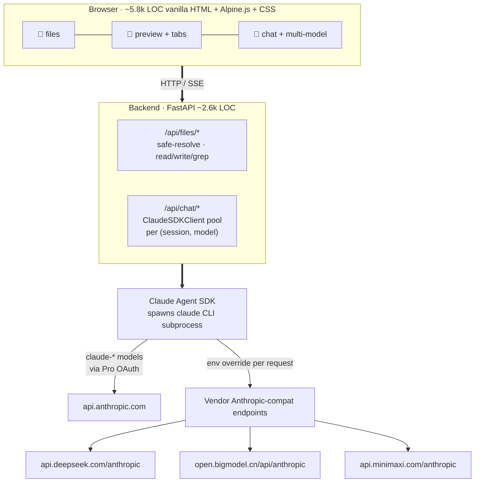

# muselab

### Meet **Muse** — an AI assistant that actually knows you.
*muselab is the open, self-hosted lab where Muse lives — alongside your archive.*

> A web **harness for Anthropic's Claude Agent SDK**, pointed at **your own files**, running **entirely on your machine**, written in **plain HTML**.

[](https://github.com/hesorchen/muselab/actions/workflows/ci.yml)
[](LICENSE)
[](tests/)
[](https://github.com/hesorchen/muselab/pkgs/container/muselab)
[](README_zh.md)

---

### Three things `muselab` actually is

**🧠 A first-class Claude Agent SDK harness**
The full agent loop (MCP servers, Skills, Subagents, plan mode, tool use,
CLAUDE.md auto-load) — the same engine that powers Claude Code, but exposed
through a browser and pointed at your personal archive. Most "Claude UIs"
wrap the CLI or speak raw API; muselab uses the official SDK directly, so
when Anthropic ships a feature it lights up automatically. The same agent
loop also runs against DeepSeek / GLM / MiniMax through their
Anthropic-compatible endpoints — no protocol translator in between.

**🏠 Local self-host, data stays put**
The whole app fits in ~150 MB RAM, binds to `127.0.0.1` by default, and
your archive lives at a path you control. Anthropic / DeepSeek / GLM see
the messages you actually send them; everything else — files, sessions,
intake answers, CLAUDE.md — never leaves the machine. SSH tunnel from your
laptop if you self-host on a VPS; Tailscale for "always on" personal
servers; never open port 8765 to the public web.

**🛠 HTML-native, no JavaScript build chain**
Vanilla HTML + [Alpine.js](https://alpinejs.dev) + plain CSS, served as
static files. No npm, no webpack, no transpiler, no React, no Vue, no
Svelte. You can read every line of the frontend in an afternoon. This is
the same instinct behind [htmx](https://htmx.org), [11ty](https://www.11ty.dev),
[Hotwire](https://hotwired.dev), [Pieter Levels' $1M/yr PHP+jQuery
indie-hacker case](https://twitter.com/levelsio), and the broader pushback
against [the web getting fatter year over year](https://infrequently.org/2024/01/performance-inequality-gap-2024/) —
boring tech you can fully see beats clever tech you can't.

---

- 💸 Reuse your `$20–100/mo` Pro / Max subscription via OAuth — zero per-token bill
- 🌏 Or bring **DeepSeek / GLM / MiniMax** keys — same SDK loop, no proxy needed
- 🚀 One installer per OS (Linux / macOS / Windows) or `docker run` from GHCR
- ⚡ ~8 k lines · 148 tests · runs on a 1 GB VPS

> 📸 *Demo gif: coming soon. In the meantime, scroll to [Architecture](#under-the-hood) for a mermaid diagram of the data flow, or jump straight to [Quick start](#quick-start) — 3 commands to running locally.*

---

## Table of contents

- [Is this for me?](#is-this-for-me)
- [Quick start](#quick-start) — 3 commands
- [Use any model](#use-any-model) — provider matrix
- [How it compares](#how-it-compares) — vs claude-code-ui, LobeChat, AnythingLLM, others
- [A day with muselab](#a-day-with-muselab) — concrete examples
- [Under the hood](#under-the-hood) — architecture
- [Security model](#security-model) — what's baked in, what's on you
- [The nine Muses](#the-nine-muses) — naming + mascot system
- [Status & contributing](#status--contributing)

---

## Is this for me?

| You... | muselab? |
|--------|----------|
| ✅ Have a Claude Pro / Max sub and want to stop paying API fees on top | **Yes** |
| ✅ Keep notes / health records / finance log in a flat directory and want AI to actually read them | **Yes** |
| ✅ Self-host on a VPS / mini-PC and want one tool you can read end-to-end | **Yes** |
| ✅ Want the same agent loop (MCP, Skills, tools) across Claude *and* DeepSeek/GLM/MiniMax | **Yes** |
| ❌ Want a coding IDE with Claude integration | Use [claudecodeui](https://github.com/siteboon/claudecodeui) or [code-server + Cline](https://github.com/cline/cline) instead |
| ❌ Want chat over crawled / RAG'd public docs | Use [AnythingLLM](https://github.com/Mintplex-Labs/anything-llm) |
| ❌ Want a hosted SaaS, no install | muselab is self-host only; pick [LobeChat Cloud](https://lobehub.com) |

---

## Quick start

### 0. Prereqs (3 minutes)

Need exactly two things:

#### Pick at least one model provider

| If you have… | Setup |
|----------------|-------|
| **Claude Pro / Max** sub ($20–100/mo) | Install [`claude` CLI](https://docs.claude.com/claude-code) then run `claude login` once. Pro OAuth lives in `~/.claude/.credentials.json` |
| Just want a cheap key | Get one from [DeepSeek](https://platform.deepseek.com) / [智谱 GLM](https://bigmodel.cn) / [MiniMax 国内站](https://minimaxi.com). Paste it in Settings later — no CLI |
| Both | Use Claude for hard reasoning, DeepSeek for cheap. Switch model in a dropdown click |

Without any of these, muselab installs fine but **the first chat will error**.
The UI explicitly warns "no provider configured — open Settings" so you won't
be left confused.

#### Install `uv`

```bash
# Linux / macOS
curl -LsSf https://astral.sh/uv/install.sh | sh
```

```powershell
# Windows PowerShell — first allow scripts (default is Restricted),
# then install uv. Reopen PowerShell after the policy change.
Set-ExecutionPolicy RemoteSigned -Scope CurrentUser
powershell -c "irm https://astral.sh/uv/install.ps1 | iex"
```

### 1. One-shot installer

Autostart at login, localhost-only, ~3 min on a decent machine (10+ on slow VPS).

```bash
# Linux / macOS
git clone https://github.com/hesorchen/muselab && cd muselab

bash scripts/install-macos.sh    # macOS — user LaunchAgent
bash scripts/install-linux.sh    # Linux — user systemd service
```

```powershell
# Windows — Task Scheduler. PowerShell 5.1 doesn't support && — run as two lines.
git clone https://github.com/hesorchen/muselab
cd muselab
powershell -ExecutionPolicy Bypass -File scripts\install-windows.ps1
```

What it does: pre-flight checks → `uv sync` → write `.env` with random token →
7-question profile intake → register autostart → wait up to 30s for service.

### 2. Open it

Local machine: `http://localhost:8765` → paste the token from `.env`.

**Running on a VPS?** Don't open the port to the internet. SSH tunnel from
your laptop:

```bash
ssh -L 8765:127.0.0.1:8765 your-vps-user@your-vps-host
# then visit http://localhost:8765 in your laptop's browser
```

Or use [Tailscale](https://tailscale.com) — same effect, no terminal.

### 3. Verify

```bash
bash scripts/doctor.sh        # Linux / macOS
powershell -ExecutionPolicy Bypass -File scripts\doctor.ps1   # Windows
```

`doctor` checks every layer (uv / claude CLI / .env / service / HTTP / token /
provider keys) and gives specific advice on any failure. Run it when
something feels off.

#### Survives reboot?

| OS | Reboot → log back in | Reboot → never log in |
|----|---------------------|------------------------|
| **macOS** | ✅ auto-starts | n/a (always log in on Mac) |
| **Linux** | ✅ auto-starts | ⚠️ needs one-time `sudo loginctl enable-linger $USER` |
| **Windows** | ✅ auto-starts | n/a (Task Scheduler is "At Logon") |

Per-OS detail (verify / restart / tail logs / expose to LAN / uninstall):
[macOS](docs/install-macos.md) · [Linux](docs/install-linux.md) · [Windows](docs/install-windows.md).

### Alternative — Docker

<details>
<summary><b>Pre-built image from GHCR (multi-arch amd64 + arm64)</b></summary>

```bash
docker run -d --name muselab \
  -p 8765:8765 \
  -e MUSELAB_TOKEN=$(openssl rand -hex 32) \
  -v $HOME/muselab-archive:/root/muselab-archive \
  -e MUSELAB_ROOT=/root/muselab-archive \
  -v $HOME/.claude:/root/.claude \
  ghcr.io/hesorchen/muselab:latest
```

Pin a version: `ghcr.io/hesorchen/muselab:1.2.3` / `:1.2` / `:sha-abc1234`.
</details>

<details>
<summary><b>Docker Compose</b></summary>

```bash
git clone https://github.com/hesorchen/muselab && cd muselab
cp .env.example .env && $EDITOR .env    # set MUSELAB_TOKEN, ARCHIVE_DIR
claude login                              # host-side; container reuses OAuth
docker compose up -d
```
</details>

<details>
<summary><b>Native dev (uv, no service)</b></summary>

```bash
cd muselab && uv sync
cp .env.example .env && $EDITOR .env
claude login
uv run python -m backend.main             # binds MUSELAB_HOST:MUSELAB_PORT
```
</details>

---

## Use any model

muselab uses the **Claude Agent SDK** as the single chat backend. For non-Claude
models, a per-session env override routes the SDK at the vendor's
Anthropic-compatible endpoint. **Every provider gets the full agent loop** —
not just chat. No proxy, no protocol translation.

| Provider | How to enable | Tool use | Cost note |
|---|---|---|---|
| **Anthropic Claude** (Opus / Sonnet / Haiku) | `claude login` once | ✅ | Reuses Pro/Max OAuth — no API key, no per-token bill |
| **DeepSeek** (V4 Pro / V4 Flash / Chat / Reasoner) | `DEEPSEEK_API_KEY` in Settings | ✅ | ~10× cheaper than Claude for chat-heavy tasks |
| **智谱 GLM** (GLM-5 / GLM-5 Air / GLM-4.7 / 4 Plus) | `ZHIPUAI_API_KEY` | ✅ | Free tier on bigmodel.cn |
| **MiniMax** (M2.7 / M2.7 Highspeed / M2.5) | `MINIMAX_API_KEY` | ✅ | Note: returns thinking blocks by default |

**Switching model mid-conversation**: dropdown → confirm modal → spawns a fresh
session with the new model (avoids cross-vendor thinking-signature drift).

**Adding a new provider** takes 3 lines in `backend/endpoints.py` — see
[docs/add-provider.md](docs/add-provider.md).

---

## How it compares

|  | muselab | claudecodeui | LobeChat | AnythingLLM | Claude Code CLI |
|---|---|---|---|---|---|
| Primary purpose | Archive + AI chat | IDE for multi-CLI agents | Multi-model chat + plugin store | RAG over your docs | Terminal coding agent |
| Self-hosted | ✅ | ✅ | ✅ | ✅ | ❌ |
| Browser access | ✅ | ✅ | ✅ | ✅ | ❌ |
| HTML / PDF / image preview | ✅ first-class | ⚠️ | ⚠️ | ⚠️ | ❌ |
| **Full agent SDK on every model** | ✅ | ⚠️ Claude-mostly | ❌ chat only | ❌ RAG focus | ✅ Claude only |
| Reuse Claude Pro subscription | ✅ | ✅ | ❌ | ❌ | ✅ |
| Lines of code | ~8 k | tens of k | hundreds of k | ~150 k | closed |
| Install command count | 3 | many | docker compose | docker | brew/npm |

If you want **IDE breadth**, pick claudecodeui or code-server.
If you want a **plugin marketplace**, LobeChat.
If you want **chat over crawled docs**, AnythingLLM.

muselab's pitch is opposite: **the smallest readable archive + AI surface that
gives every model Claude's full agent power**.

### Compared specifically to other Claude harnesses

| | muselab | Claude Code CLI | Claude Desktop | claudecodeui | claude-code-router |
|---|---|---|---|---|---|
| Uses official **Claude Agent SDK** | ✅ direct | ✅ (the canonical impl) | ✅ | ❌ wraps CLI process | ❌ protocol translator |
| Web UI in browser | ✅ | ❌ TTY | ❌ desktop | ✅ | ❌ |
| Personal-archive focus | ✅ | ❌ coding | ❌ general | ❌ coding | ❌ |
| **Same agent loop on non-Claude models** | ✅ via vendor anthropic-compat | ❌ Anthropic only | ❌ Anthropic only | partial | ⚠ via translation, drops features |
| Self-host friendly | ✅ | n/a (you already have it) | ❌ closed binary | ✅ | ✅ |
| Open source | ✅ MIT | ❌ | ❌ | ✅ MIT | ✅ MIT |

"muselab is to your archive what Claude Code is to your codebase" is the
shortest accurate one-liner.

---

## A day with muselab

Real examples from a working session:

```
Morning  →  @health/2026-04-checkup.pdf 解读这份体检报告，对比去年同期，
            重点说骨密度趋势。 (Muse cites the Endocrine Society guideline,
            quotes specific numbers, suggests next steps)

Noon     →  Drag-drop investment/research/HSTU-paper.pdf into Files pane
         →  @investment/HSTU-paper.pdf @investment/portfolio.md
            这个新策略适合纳入我现有持仓吗？ (Muse cross-references both,
            answers based on CLAUDE.md's investment guardrails)

Evening  →  Open health/training-log.md in CodeMirror, add today's entry, Ctrl+S
         →  分析最近 3 个月的训练频率和强度变化 (Muse spots the pattern)

Anytime  →  Type / in chat → see slash commands: /help /compact /clear /resume
         →  Type @ → autocomplete from your archive's file tree
         →  Switch model dropdown → confirm → fresh session with new model
```

**CLAUDE.md auto-loads** from `~/.claude/CLAUDE.md` (your global rules) AND
`<archive-root>/CLAUDE.md` (per-archive rules), so Muse knows you in every
session. The installer's 7-question intake seeds your archive's CLAUDE.md with
your real profile — see [docs/personalize-claude-md.md](docs/personalize-claude-md.md).

---

## Under the hood



**Key design choices**:

- **SDK > raw API**. We use Claude Agent SDK (same engine as Claude Code), so MCP / Skills / Subagents / plan mode / CLAUDE.md auto-load work uniformly across providers. Adding a new provider = 3 lines, not 300.
- **`env=` override per session**. SDK passes a fresh env dict to its subprocess. For DeepSeek/GLM/MiniMax we set `ANTHROPIC_BASE_URL` + `ANTHROPIC_API_KEY` and an isolated `CLAUDE_CONFIG_DIR` (otherwise the CLI silently falls back to Pro OAuth → bills Anthropic).
- **No bundler, no transpiler**. Edit a file, refresh, done. `vendor/` carries vetted runtime (Alpine, marked, DOMPurify, KaTeX, hljs) so install never hits npm.
- **Session = `(session_id, model)`** cached client. Switching model spawns a fresh client; per-message `model` field on assistant bubbles keeps badges accurate after reload.

---

## Security model

⚠️ **A leaked `MUSELAB_TOKEN` ≈ shell-level read/write on `MUSELAB_ROOT`.**
Chat sessions run with `permission_mode="bypassPermissions"` by default —
Claude can read/write any file under that root without per-call confirmation.

**Baked in**:

- `MUSELAB_ROOT` blocklist: refuses `/`, `/etc`, `/root`, `/home`, `/var`, `/usr`, `/boot`, `$HOME`
- `MUSELAB_TOKEN` minimum 16 chars enforced at startup
- Path traversal & **symlink escape** protection (`safe_resolve` checks resolved real path)
- Sensitive filename blocking: `.env*`, `id_rsa`, `*.pem`, `credentials*` — refused for read **and** upload
- Upload size cap (100 MB, configurable) + executable extension blocklist
- XSS protection: all markdown rendering passes through DOMPurify
- HTML / SVG preview in `iframe sandbox="allow-scripts"` + strict CSP (no token leak from sandbox)
- File preview: blacklist + content sniff (no whitelist that needs updating per new file type)

**You handle**:

- Run as your normal user — installer refuses `sudo`
- Point `MUSELAB_ROOT` at a dedicated directory, not your home
- Keep the token random and out of git
- For LAN exposure: HTTPS + nginx basic auth on top
- For VPS: SSH tunnel or Tailscale, **not** open port 8765 to the internet

See [SECURITY.md](SECURITY.md) for the threat model + responsible disclosure.

---

## The nine Muses

muselab takes its name from the **nine Muses** of Greek mythology — the
goddesses who inspire art and learning. **Muse** is the AI persona inside;
**muselab** is the workshop she lives in.

Each session boots a different muse (hashed from date + hour — stable within
an hour, rotates daily). Click the mascot in the chat header to cycle.
The favicon follows along — your browser tab quietly carries today's muse.

| Muse | Domain | Geometric form |
|---|---|---|
| Calliope | Epic poetry | Hex |
| Clio | History | Stacked bars |
| Erato | Love poetry | Vesica piscis (lens) |
| Euterpe | Music | Sine wave |
| Melpomene | Tragedy | Crescent |
| Polyhymnia | Sacred hymns | Halo |
| Terpsichore | Dance | Trio of dots |
| Thalia | Comedy | Spark |
| Urania | Astronomy | Orbit |

---

## Status & contributing

**Pre-1.0**, personal project, used daily by the author. PRs welcome — see
[CONTRIBUTING.md](CONTRIBUTING.md). The maintainer reserves the right to
reject features that bloat the codebase beyond *"readable in an afternoon"*.

- 🐛 **Bugs**: open an issue using the [bug template](.github/ISSUE_TEMPLATE/bug_report.md)
- 💡 **Features**: use the [feature template](.github/ISSUE_TEMPLATE/feature_request.md)
- 🔌 **Provider not working**: use the [provider template](.github/ISSUE_TEMPLATE/provider_issue.md) (paste sanitized vendor response)
- 📋 **Roadmap / known issues**: [TODO.md](TODO.md)
- 🔒 **Security**: don't open a public issue — see [SECURITY.md](SECURITY.md)

## License

[MIT](LICENSE) — do what you want, no warranty.
