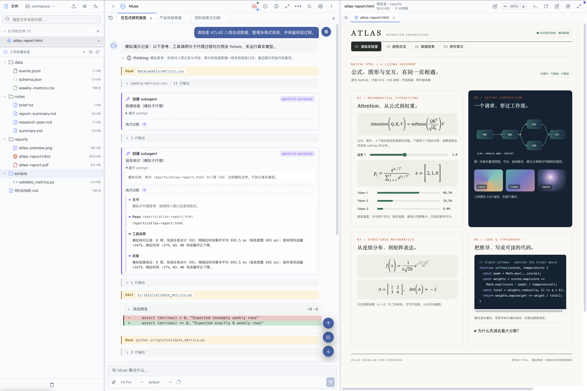
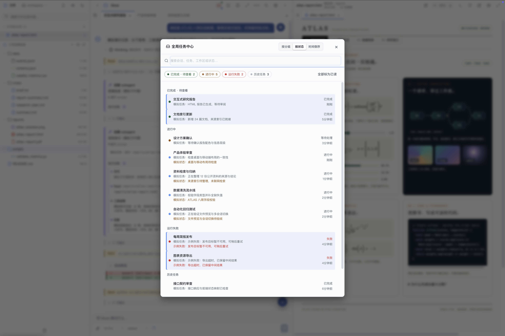
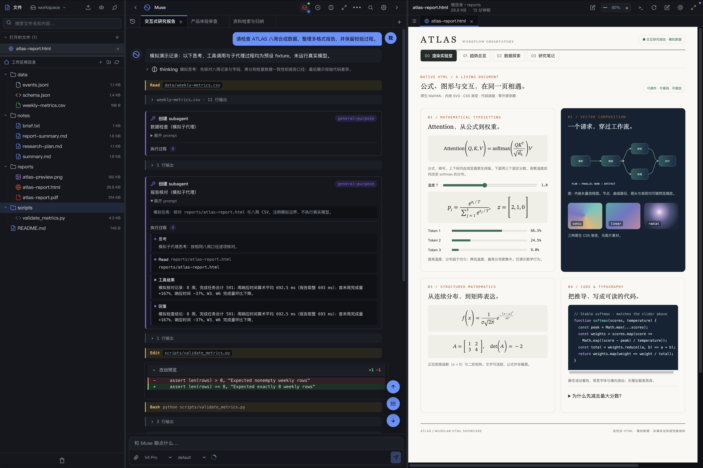
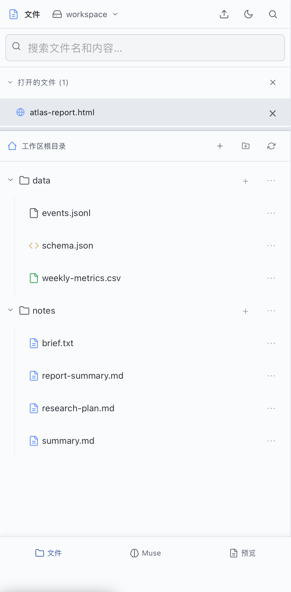

<h1 align="center">muselab</h1>

<p align="center">
  <a href="https://github.com/hesorchen/muselab/actions/workflows/ci.yml"></a>
  <a href="LICENSE"></a>
  <a href="docs/quickstart.md"></a>
  <a href="https://github.com/hesorchen/muselab/pkgs/container/muselab"></a>
  <a href="https://deepwiki.com/hesorchen/muselab"></a>
  <a href="README.md"></a>
</p>

<p align="center"><strong>muselab is a self-hosted, agent-native workspace built on the Claude Agent SDK.</strong></p>

<p align="center">Agent interaction, workspace switching, global task management, and cross-device sync.</p>

<p align="center"><a href="#quick-start">Quick start</a> · <a href="#core-features">Core features</a> · <a href="docs/README.md">Documentation</a> · <a href="https://hesorchen.github.io/muselab/promo/">Demos</a></p>

<p align="center"><em>Muse comes from the Muses of Greek mythology, goddesses of inspiration, art, and knowledge.</em></p>

<p align="center"><a href="promo/media/screenshot-workbench-hero.png"></a></p>
<p align="center">Desktop · files, session tabs, and HTML preview</p>

<details>
<summary>More screenshots: task center, dark theme, and mobile</summary>

<table align="center">
<tr>
<td align="center"><a href="promo/media/screenshot-task-center-demo.png"></a></td>
<td align="center"><a href="promo/media/screenshot-desktop-dark.png"></a></td>
</tr>
<tr>
<td align="center">Task center · running, failed, and completed tasks</td>
<td align="center">Desktop · dark theme</td>
</tr>
</table>

<table align="center">
<tr>
<td align="center"><a href="promo/media/screenshot-mobile-files.png"></a></td>
<td align="center"><a href="promo/media/screenshot-mobile-chat.png"></a></td>
<td align="center"><a href="promo/media/screenshot-mobile-preview.png"></a></td>
</tr>
<tr>
<td align="center">Mobile · files</td>
<td align="center">Mobile · Agent conversation</td>
<td align="center">Mobile · HTML preview</td>
</tr>
</table>

</details>

## Core features

| Feature | Description |
|---|---|
| **Agent-native workspace** | Files, sessions, previews, and real terminals organized around agent tasks, with access to execution records, file editing, and result verification |
| **Multiple workspaces** | Switch between projects, using project instructions, memory files, documentation, and Skills to organize the agent's working context |
| **Agent execution and extensions** | Tool calls, subagent timelines, code diffs, Hook status, and model usage, with support for Skills, MCP, and Hook configuration |
| **Continuous session workflows** | Session tabs, background execution, persistent message queues, session forks, and last-turn retries |
| **Global task management** | Task states and results across sessions, with background tasks, scheduled tasks, and push notifications |
| **Long-term memory** | Dreaming to consolidate task experience, hybrid recall, source evidence tracebacks, and manual correction; disabled by default and configured separately |
| **Multiple models and providers** | Claude OAuth, API keys, Codex through a separate local gateway, and configurable Anthropic-compatible endpoints |
| **File previews and editing** | Markdown, HTML, images, PDF, XLSX, CSV, TSV, and text previews, with Markdown editing and split preview |
| **Desktop and mobile** | Desktop browsers and the mobile PWA access the same working files and sessions, with English/Chinese UI and multiple themes |

Configuration: [Workspaces](docs/personalize-claude-md.md) · [Providers](docs/providers.md) · [Codex Gateway](docs/codex-gateway.md) · [Long-term memory](docs/memory.md).

## Quick start

**One-line install** (Linux + macOS + WSL2):

```bash
curl -fsSL https://raw.githubusercontent.com/hesorchen/muselab/main/scripts/quick-install.sh | bash
```

**Manual install** (install [uv](https://docs.astral.sh/uv/getting-started/installation/) first):

```bash
git clone https://github.com/hesorchen/muselab && cd muselab
bash scripts/install-linux.sh    # or install-macos.sh
```

Python 3.12 or newer is required; the frontend needs no npm build. The bootstrap script installs `uv`; platform installers sync dependencies and attempt to install Node and the CLI when needed. See [Quick start](docs/quickstart.md) for Docker, development mode, and detailed prerequisites.

**Verify after installation**:

1. Open `http://localhost:8765` in a browser on the installation machine.
2. Log in with the `MUSELAB_TOKEN` configured during installation.
3. Select a workspace and configure at least one model. See [Providers](docs/providers.md) for setup instructions.
4. Send `hello`, confirm Muse responds, and open a file to check its preview.

For installation or runtime issues, run `bash scripts/doctor.sh` from the repository directory to check the environment and obtain repair suggestions.

> **Windows users:** install through WSL2 (see [Quick start](docs/quickstart.md#windows-via-wsl2)).
>
> **Unattended installation:** `MUSELAB_NONINTERACTIVE=1 bash scripts/install-linux.sh`. See the platform installation guide for configuration requirements.

## Docs

**[📚 Full documentation index](docs/README.md)**

- **Get started:** [Quick start](docs/quickstart.md) · [Linux install](docs/install-linux.md) · [macOS install](docs/install-macos.md) · [Upgrade](docs/upgrade.md)
- **Usage:** [Workbench controls](docs/workbench-ui.md) · [Configure workspace CLAUDE.md](docs/personalize-claude-md.md) · [Skills](docs/skills.md) · [Terminal](docs/terminal.md) · [Mobile PWA](docs/mobile.md) · [Scheduled tasks](docs/scheduler.md) · [Long-term memory](docs/memory.md)
- **Models:** [Providers](docs/providers.md) · [Codex Gateway](docs/codex-gateway.md) · [Add a provider](docs/add-provider.md) · [Model routing](docs/routing.md)
- **Internals:** [Architecture](docs/architecture.md) · [Sessions](docs/backend-sessions.md) · [Files API](docs/backend-files.md) · [Security model](docs/backend-security.md) · [Frontend](docs/frontend.md) · [Infrastructure](docs/infrastructure.md)
- **Reference:** [Configuration](docs/configuration.md) · [Data & backup](docs/data-and-backup.md) · [Troubleshooting](docs/troubleshooting.md) · [Glossary](docs/glossary.md)
- **Concepts:** [How it compares](docs/comparison.md) · [The nine Muses](docs/muses.md)
- **Project:** [Security](SECURITY.md) · [Contributing](CONTRIBUTING.md) · [Third-party licenses](THIRD_PARTY_LICENSES.md)

## Status

Current version: v1.2. Before updating an existing installation, read the [Upgrade guide](docs/upgrade.md) and back up your data.

[MIT](LICENSE)
