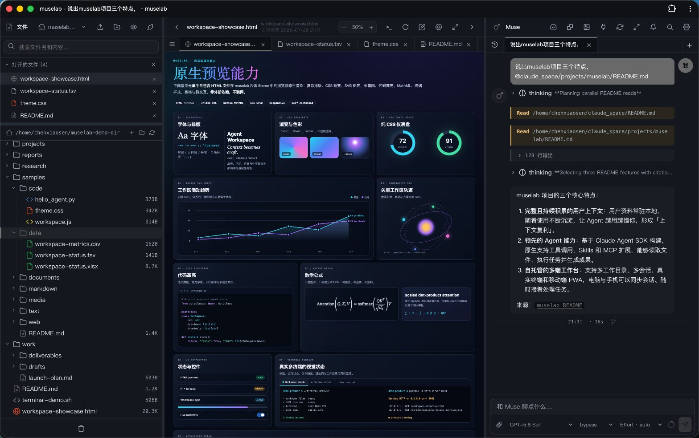
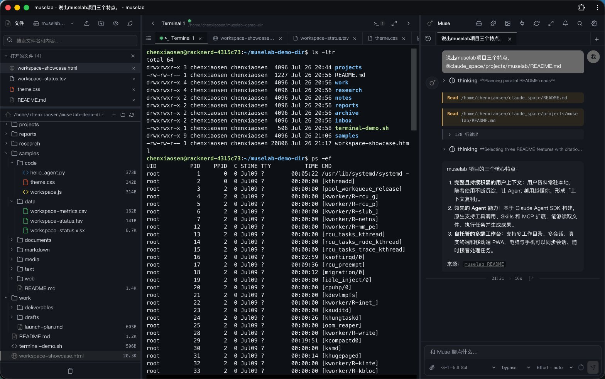
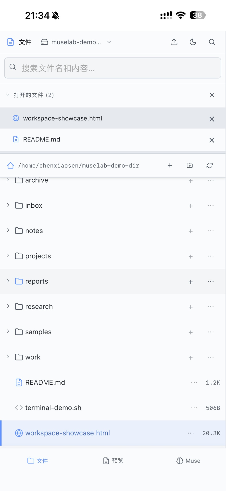
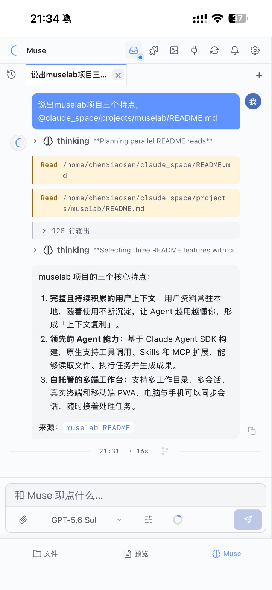

<h1 align="center">muselab</h1>

<p align="center">
  <a href="https://github.com/hesorchen/muselab/actions/workflows/ci.yml"></a>
  <a href="LICENSE"></a>
  <a href="docs/quickstart.md"></a>
  <a href="https://github.com/hesorchen/muselab/pkgs/container/muselab"></a>
  <a href="https://deepwiki.com/hesorchen/muselab"></a>
  <a href="README.md"></a>
</p>

<p align="center"><strong>muselab is a self-hosted agent workspace built on the Claude Agent SDK.</strong></p>

<p align="center"><em>Muse comes from the Muses of Greek mythology, goddesses of inspiration, art, and knowledge.</em></p>

<table align="center">
<tr>
<td align="center"><a href="promo/media/screenshot-desktop.png"></a></td>
<td align="center"><a href="promo/media/screenshot-desktop-terminal.png"></a></td>
</tr>
<tr>
<td align="center">Desktop · files, preview, and chat</td>
<td align="center">Desktop · real Unix PTY terminal</td>
</tr>
</table>

<table align="center">
<tr>
<td align="center"><a href="promo/media/screenshot-mobile-files.jpeg"></a></td>
<td align="center"><a href="promo/media/screenshot-mobile-preview.png"></a></td>
<td align="center"><a href="promo/media/screenshot-mobile-chat.png"></a></td>
</tr>
<tr>
<td align="center">Mobile · files</td>
<td align="center">Mobile · native preview</td>
<td align="center">Mobile · Agent chat</td>
</tr>
</table>

<p align="center"><sub>Click any image to view the original.</sub></p>

## Core features

| | |
|---|---|
| **Reuse existing subscriptions** | Claude supports OAuth; Codex can connect through Gateway, allowing you to reuse existing Claude and ChatGPT subscription services |
| **Integrated Agent workspace** | Browse files, preview reports, interact with an Agent, and run or inspect results in a real terminal—all on the same page |
| **Multiple working directories** | Create and switch among multiple working directories with one click; each directory is a complete Agent context and runtime environment |
| **Real Unix PTY terminals** | Create, rename, and switch among multiple real terminals; each terminal stays bound to the directory where it was created and supports Terminal Profiles |
| **Claude Agent SDK** | Native file operations, tool use, Skills, and MCP support let the Agent execute tasks directly and produce persistent artifacts |
| **Native file preview** | Preview Markdown, text, HTML, images, PDF, XLSX, CSV, TSV, and more |
| **Multiple models and Providers** | Built-in Claude and Codex Gateway Providers, plus support for Anthropic-compatible model services such as Kimi, GLM, and DeepSeek |
| **Self-hosted, multi-device access** | Working directories, session state, and generated files stay local, while desktop browsers and the mobile PWA keep content in sync across devices |

## Quick start

**One-line install** (Linux + macOS + WSL2):

```bash
curl -fsSL https://raw.githubusercontent.com/hesorchen/muselab/main/scripts/quick-install.sh | bash
```

**Manual install**:

```bash
git clone https://github.com/hesorchen/muselab && cd muselab
bash scripts/install-linux.sh    # or install-macos.sh
```

**Verify after installation**:

1. Open `http://localhost:8765` in your browser
2. Paste `MUSELAB_TOKEN` to log in
3. Configure at least one model
4. Send `hello` and confirm Muse responds

Something wrong? Run `bash scripts/doctor.sh` for layered diagnostics and concrete repair suggestions.

> **Windows users:** install through WSL2 (see [Quick start](docs/quickstart.md#windows-via-wsl2)).
>
> **Unattended mode** (CI / Docker / demo recording): `MUSELAB_NONINTERACTIVE=1 bash ...`

## Session practice

> "This is my checkup report from this year. Compare it with last year's report and turn the metric changes into a one-page HTML trend report."

Muse finds both PDFs in `health/`, reads the files, extracts the metrics, and writes a single-file HTML report with charts — rendered directly in the preview pane. Then you say:

> "Now check the insurance policies in `money/`. Do these metric changes reveal any coverage gaps?"

Archives from two domains are analyzed in the same session, producing concrete guidance.

🌐 More scene demos on the [muselab promo page](https://hesorchen.github.io/muselab/promo/).

## Why not existing solutions?

| Solution | Limitation | How muselab works |
|---|---|---|
| ChatGPT / Claude.ai | Files are uploaded temporarily; memory is a black box | Archived files stay local, with a transparent memory mechanism |
| Claude Code | Born in the terminal, built for code | The same Agent Harness, aimed at life files, usable on desktop and phone |
| RAG document chat | Chunking + retrieval loses cross-document meaning; better suited for massive document sets | Stores source documents and reads complete files for lossless understanding |

Full comparison (Open WebUI / LobeChat / AnythingLLM / claudecodeui, etc.): [How it compares](docs/comparison.md).

## Practical details

- **Modern file tree** — Modern file operations: drag-and-drop upload, fuzzy search, rename, and trash
- **Files and terminals in one preview surface** — Markdown, text, spreadsheets, and HTML restore their reading position; real PTY terminals support multiple instances, profiles, and mobile controls
- **Workspace isolation** — Register multiple local directories and switch files, previews, session tabs, and new-session cwd as one surface
- **Session workspace** — Multi-session tabs, pinning and search, background streaming, persistent queues, context usage, and turn timing
- **Global search** — Search file names, file contents, sessions, message history, and common actions from one place
- **Editing and previewing** — Markdown editing, split preview, find-in-preview, zoom, and retained live HTML page state
- **Self-healing sessions** — After mobile suspension or a silent SSE drop, muselab probes, reconnects, and pulls the final message automatically
- **Multiple modes and themes** — Light / dark / eye-care themes, with your own accent color
- **Bilingual UI** — Switch between English and Chinese in one click, without refreshing the page
- **Message queue** — Keep sending messages while Muse thinks; the queue runs them in order so no idea is lost
- **Tasks and notifications** — Scheduled jobs, background work, the activity center, and Web Push report results in one flow

## Docs

**[📚 Full documentation index](docs/README.md)**

- **Get started:** [Quick start](docs/quickstart.md) · [Linux install](docs/install-linux.md) · [macOS install](docs/install-macos.md) · [Upgrade](docs/upgrade.md)
- **Usage:** [Personalize CLAUDE.md](docs/personalize-claude-md.md) · [Skills](docs/skills.md) · [Terminal](docs/terminal.md) · [Mobile PWA](docs/mobile.md) · [Scheduled tasks](docs/scheduler.md)
- **Models:** [Providers](docs/providers.md) · [Codex Gateway](docs/codex-gateway.md) · [Add a provider](docs/add-provider.md) · [Model routing](docs/routing.md)
- **Internals:** [Architecture](docs/architecture.md) · [Sessions](docs/backend-sessions.md) · [Files API](docs/backend-files.md) · [Security model](docs/backend-security.md) · [Frontend](docs/frontend.md) · [Infrastructure](docs/infrastructure.md)
- **Reference:** [Configuration](docs/configuration.md) · [Data & backup](docs/data-and-backup.md) · [Troubleshooting](docs/troubleshooting.md) · [Glossary](docs/glossary.md)
- **Concepts:** [How it compares](docs/comparison.md) · [The nine Muses](docs/muses.md)
- **Project:** [Security](SECURITY.md) · [Contributing](CONTRIBUTING.md) · [Third-party licenses](THIRD_PARTY_LICENSES.md)

## Status

v1.2 — multi-workspace support, a real terminal, and richer agent workflows.

[MIT](LICENSE)
