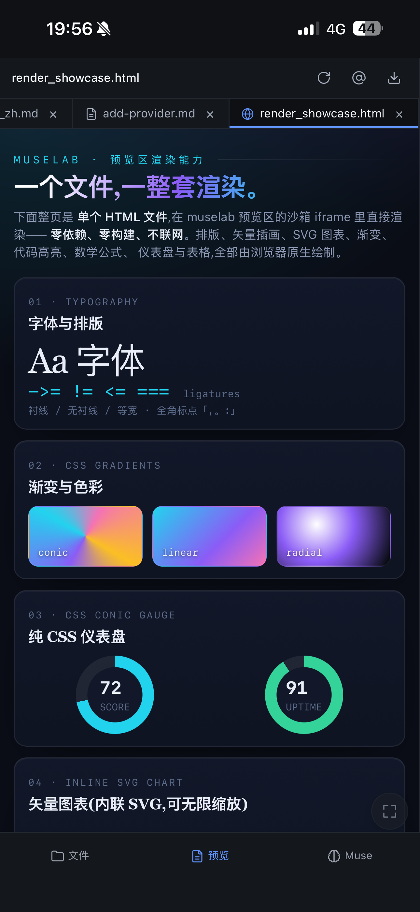

# muselab

[](https://github.com/hesorchen/muselab/actions/workflows/ci.yml)
[](LICENSE)
[](docs/quickstart_zh.md)
[](https://github.com/hesorchen/muselab/pkgs/container/muselab)
[](README.md)

Muse（muselab 内置的 AI 助手）同时阅读你的体检 PDF、预算表格、家庭信息、资产配置、职业规划，帮助你完成跨领域决策。

- 🧠 **最真实的语义信息。** 不向量化，PDF、表格、Markdown、HTML 保留最原始的信息，Muse 直接读取，资料越丰富，任务完成质量越高。

- 🤖 **Claude Agent SDK × 八家模型。** MCP 工具、Skills、Subagent、plan 模式全部保留——不止聊天，真正交付。Claude / DeepSeek / GLM / MiniMax / Kimi / Qwen / MiMo / ERNIE，多种模型，一键切换。

- 🖥️ **实时渲染，多端同步。** Muse 生成的 HTML 报告、Markdown 文档直接在预览区实时渲染。桌面、手机多端会话同步，支持 PWA 和推送通知。

<p align="center">
  
  &nbsp;&nbsp;
  
</p>
<p align="center"><em>丰富的渲染能力，多端实时同步——HTML 报告、表格、图表即写即渲染，桌面与手机共享同一会话。</em></p>

## 看效果

🌐 [muselab 介绍页](https://hesorchen.github.io/muselab/promo/) —
   场景演示、能力一览、对比与 FAQ，快速了解 muselab 能做什么。

## 安装

> 前置：`git`、`curl`（Linux / macOS 自带；WSL2 需 `sudo apt install git curl`）。

**一行命令**（Linux + macOS + WSL2）——安装 `uv`，克隆仓库至 `~/muselab`，由平台安装程序自动安装 Node LTS 与 Anthropic `claude` CLI，并完成服务注册：

```bash
curl -fsSL https://raw.githubusercontent.com/hesorchen/muselab/main/scripts/quick-install.sh | bash
```

> **Windows 用户：** 请通过 WSL2 安装（参见 [Quick start](docs/quickstart_zh.md#windows-用户走-wsl2)）。

**无人值守**——CI / Docker / 录 demo 用。全部取默认值（随机 token、端口 8765、`~/muselab-archive`），跳过所有交互：

```bash
curl -fsSL https://raw.githubusercontent.com/hesorchen/muselab/main/scripts/quick-install.sh | MUSELAB_NONINTERACTIVE=1 bash
```

**手动安装**——逐步执行每条命令：

```bash
git clone https://github.com/hesorchen/muselab && cd muselab
bash scripts/install-linux.sh    # 或 install-macos.sh
```

访问 `http://localhost:8765`，粘贴 `.env` 中的 token。若安装脚本末尾提示「claude CLI 已装但未登录」，执行一次 `claude login` 即可激活 Anthropic 模型。

环境要求、Docker、开发模式与各平台详细说明，参见 [快速入门](docs/quickstart_zh.md)。

## 文档

**[📚 完整文档索引](docs/README_zh.md)**

- **上手：** [快速入门](docs/quickstart_zh.md) ·
  [定制 CLAUDE.md](docs/personalize-claude-md_zh.md) ·
  [手机端 PWA](docs/mobile_zh.md) ·
  [定时任务](docs/scheduler_zh.md)
- **模型：** [Providers](docs/providers_zh.md) ·
  [接入新 provider](docs/add-provider_zh.md)
- **参考：** [配置](docs/configuration_zh.md) ·
  [数据与备份](docs/data-and-backup_zh.md) ·
  [排错](docs/troubleshooting_zh.md) ·
  [升级](docs/upgrade_zh.md)
- **概念：** [架构](docs/architecture_zh.md) ·
  [同类对比](docs/comparison_zh.md) ·
  [九位缪斯](docs/muses_zh.md)
- **项目：** [安全](SECURITY.md) ·
  [贡献指南](CONTRIBUTING.md) ·
  [第三方授权](THIRD_PARTY_LICENSES.md)

## 状态

v1.0——首个稳定版。欢迎提交 PR——参见 [CONTRIBUTING.md](CONTRIBUTING.md)。路线图与已知问题见 [GitHub Issues](https://github.com/hesorchen/muselab/issues)。

[MIT](LICENSE)
