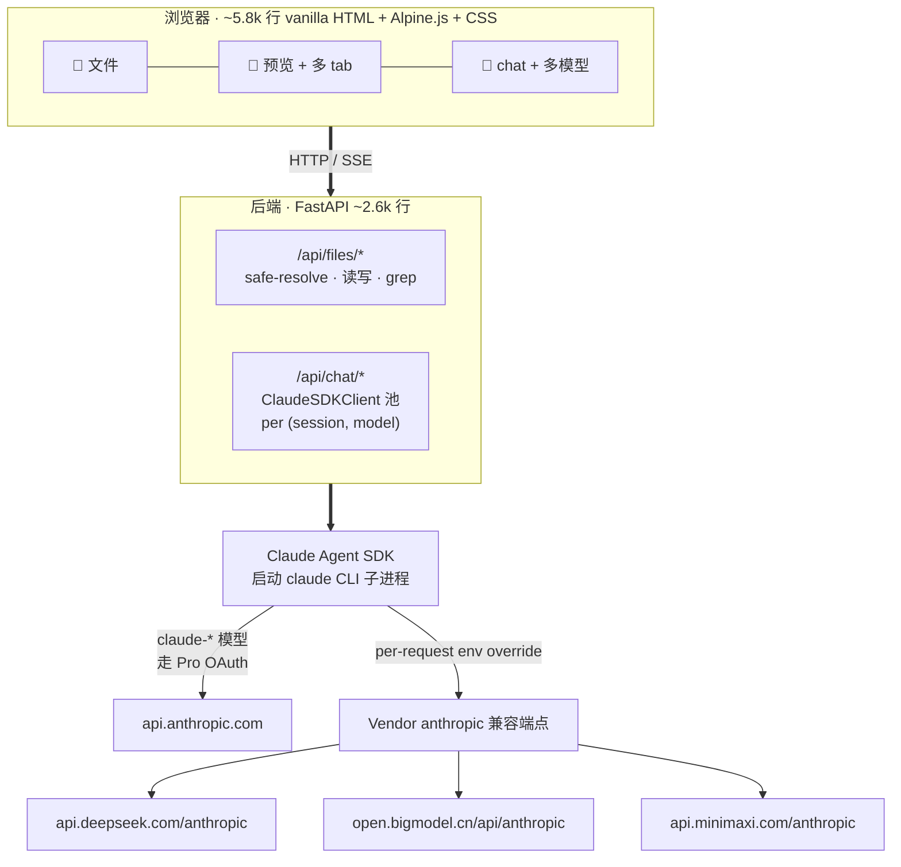

# muselab

### 见见 **Muse** —— 真的认识你的 AI 助理。
*muselab 是 Muse 居住的自托管"工坊"，跟你的档案为邻。*

> **Anthropic Claude Agent SDK** 的 web harness，指向**你自己的档案**，**完全本地运行**，用**纯 HTML** 编写。

[](https://github.com/hesorchen/muselab/actions/workflows/ci.yml)
[](LICENSE)
[](tests/)
[](https://github.com/hesorchen/muselab/pkgs/container/muselab)
[](README.md)

---

### `muselab` 的三个核心定位

**🧠 直接构建于 Anthropic 官方 Claude Agent SDK 之上的 harness**
完整 agent 能力（MCP / Skills / Subagent / plan / 工具调用 / CLAUDE.md
自动加载）——与 Claude Code 同一引擎，但通过浏览器暴露并指向你的个人
archive。多数所谓"Claude UI"是封装 CLI 进程，或直接调用原始 API；
muselab 直接使用官方 SDK，**Anthropic 发布新功能时自动生效**。同一套
agent loop 通过 anthropic-compatible 端点也运行于 DeepSeek / GLM /
MiniMax 之上——中间无协议翻译层。

**🏠 本地自托管，数据不离开本机**
应用占用约 150 MB 内存，默认仅绑定 `127.0.0.1`，archive 位于你指定的
路径。Anthropic / DeepSeek / GLM 仅接收你实际发送的消息；archive 文件、
session 历史、intake 答案、CLAUDE.md 均**不离开本机**。VPS 部署建议
SSH tunnel 访问；长期在线场景使用 Tailscale；**切勿**将 8765 端口直接
暴露至公网。

**🛠 HTML-native，无 JavaScript 构建链**
纯 HTML + [Alpine.js](https://alpinejs.dev) + 原生 CSS，作为静态文件
提供。无 npm，无 webpack，无 transpiler，无 React / Vue / Svelte。
**前端可在一个晚上读完**。这一取向与 [htmx](https://htmx.org) /
[11ty](https://www.11ty.dev) / [Hotwire](https://hotwired.dev) /
[Pieter Levels 用 PHP + jQuery 实现 $1M/年的 indie 案例](https://twitter.com/levelsio)
以及 [web 体积逐年增长的反思](https://infrequently.org/2024/01/performance-inequality-gap-2024/)
属同一脉络——**完全可读的朴素技术，胜过难以审视的复杂技术**。

---

- 💸 复用 ¥150–700/月的 Pro / Max 订阅（OAuth），无 token 计费
- 🌏 也可填 **DeepSeek / GLM / MiniMax** key——同一套 SDK loop，无需 proxy
- 🚀 三个 OS 各一条 install 命令，或从 GHCR 直接 `docker run`
- ⚡ ~8 k 行代码 · 148 项测试 · 可在 1 GB 内存 VPS 运行

> 📸 *Demo gif 制作中。可先查看 [架构](#架构原理) 的 mermaid 数据流图，或直接前往 [Quick start](#quick-start) 通过 3 条命令本地启动。*

---

## 目录

- [适用判断](#适用判断)
- [Quick start](#quick-start) — 3 条命令
- [模型支持](#模型支持) — provider 矩阵
- [与同类对比](#与同类对比) — vs claudecodeui / LobeChat / AnythingLLM 等
- [典型使用场景](#典型使用场景) — 具体示例
- [架构原理](#架构原理)
- [安全模型](#安全模型) — 内置防护 + 运维责任
- [九位缪斯](#九位缪斯) — 命名与 mascot
- [状态与贡献](#状态与贡献)

---

## 适用判断

| 你的情况 | muselab 是否适合 |
|--------|----------|
| ✅ 持有 Claude Pro / Max 订阅，希望避免额外 API 费用 | **适合** |
| ✅ 笔记 / 体检 / 财务等资料整理在文件夹中，希望 AI 真正能读取 | **适合** |
| ✅ 在 VPS / 小主机上自托管，需要源码完全可审计的工具 | **适合** |
| ✅ 希望同一套 agent loop 跨 Claude 与 DeepSeek / GLM / MiniMax 一致工作 | **适合** |
| ❌ 需要集成 Claude 的代码 IDE | 推荐 [claudecodeui](https://github.com/siteboon/claudecodeui) 或 [code-server + Cline](https://github.com/cline/cline) |
| ❌ 需要对爬取 / RAG 索引的公开文档对话 | 推荐 [AnythingLLM](https://github.com/Mintplex-Labs/anything-llm) |
| ❌ 需要托管 SaaS，无意自行部署 | muselab 仅支持自托管；可参考 [LobeChat Cloud](https://lobehub.com) |

---

## Quick start

### 0. 前置准备（约 3 分钟）

仅需两项：

#### 至少配置一个模型 provider

| 你拥有的 | 配置方式 |
|----------------|-------|
| **Claude Pro / Max 订阅**（¥150–700/月） | 安装 [`claude` CLI](https://docs.claude.com/claude-code) 并执行一次 `claude login`，OAuth 凭据存于 `~/.claude/.credentials.json` |
| 仅希望使用第三方 key | 从 [DeepSeek](https://platform.deepseek.com) / [智谱 GLM](https://bigmodel.cn) / [MiniMax 国内站](https://minimaxi.com) 任选其一获取 key，于 Settings 内填入，无需 CLI |
| 同时拥有两者 | Claude 处理深度推理，DeepSeek 处理日常任务，dropdown 可一键切换 |

未配置任何 provider 时，muselab 安装仍可成功，但首次对话会失败。UI 会显示「未配置模型 — 请打开 Settings」提示。

#### 安装 `uv`

```bash
# Linux / macOS
curl -LsSf https://astral.sh/uv/install.sh | sh
```

```powershell
# Windows PowerShell — 干净 Windows 需要三步一次性配置：

# (a) 放行 PowerShell 脚本（默认 Restricted 会拒绝 uv）
Set-ExecutionPolicy RemoteSigned -Scope CurrentUser

# (b) 装 git（干净 Windows 不带）
winget install --id Git.Git -e

# (c) 装 uv
powershell -c "irm https://astral.sh/uv/install.ps1 | iex"

# 每一步之后开新的 PowerShell 窗口，让 PATH 刷新。
```

### 1. 一键安装

登录后自动启动，默认绑定 localhost，耗时约 3 分钟（VPS 较慢时 10 分钟以上）。

```bash
# Linux / macOS
git clone https://github.com/hesorchen/muselab && cd muselab

bash scripts/install-macos.sh    # macOS — 用户级 LaunchAgent
bash scripts/install-linux.sh    # Linux — 用户级 systemd
```

```powershell
# Windows — Task Scheduler。PowerShell 5.1 不支持 && — 分两行执行。
git clone https://github.com/hesorchen/muselab
cd muselab
powershell -ExecutionPolicy Bypass -File scripts\install-windows.ps1
```

脚本流程：pre-flight 检查 → `uv sync` → 生成 `.env`（含随机 token）→ 7 项 intake 写入 CLAUDE.md → 注册自启 → 等待服务可用（30s retry）。

### 2. 访问

本机：`http://localhost:8765` → 粘贴 `.env` 中的 token。

**VPS 部署场景**：不要将端口暴露至公网。建议从笔记本建立 SSH tunnel：

```bash
ssh -L 8765:127.0.0.1:8765 your-vps-user@your-vps-host
# 然后在笔记本浏览器访问 http://localhost:8765
```

或使用 [Tailscale](https://tailscale.com)——效果一致，无需终端。

### 3. 验证

```bash
bash scripts/doctor.sh        # Linux / macOS
powershell -ExecutionPolicy Bypass -File scripts\doctor.ps1   # Windows
```

`doctor` 检查各层组件（uv / claude CLI / .env / service / HTTP / token / provider keys），失败时给出具体建议。**安装完成后建议执行一次**，运行异常时同样执行。

#### 重启后是否自动启动

| OS | 重启 → 重新登录 | 重启 → 不登录 |
|----|---------------------|------------------------|
| **macOS** | ✅ 自动启动 | n/a（Mac 重启需登录）|
| **Linux** | ✅ 自动启动 | ⚠️ 需一次性执行 `sudo loginctl enable-linger $USER` |
| **Windows** | ✅ 自动启动 | n/a（Task Scheduler 触发器为 "At Logon"）|

各 OS 详细指南（验证 / 重启 / tail 日志 / 暴露 LAN / 卸载）：
[macOS](docs/install-macos.md) · [Linux](docs/install-linux.md) · [Windows](docs/install-windows.md)。

### 备选方案 — Docker

<details>
<summary><b>GHCR 预构建镜像（多架构 amd64 + arm64）</b></summary>

```bash
docker run -d --name muselab \
  -p 8765:8765 \
  -e MUSELAB_TOKEN=$(openssl rand -hex 32) \
  -v $HOME/muselab-archive:/root/muselab-archive \
  -e MUSELAB_ROOT=/root/muselab-archive \
  -v $HOME/.claude:/root/.claude \
  ghcr.io/hesorchen/muselab:latest
```

可指定具体版本：`ghcr.io/hesorchen/muselab:1.2.3` / `:1.2` / `:sha-abc1234`。
</details>

<details>
<summary><b>Docker Compose</b></summary>

```bash
git clone https://github.com/hesorchen/muselab && cd muselab
cp .env.example .env && $EDITOR .env
claude login                              # 宿主机执行，容器复用 OAuth
docker compose up -d
```
</details>

<details>
<summary><b>原生开发模式（uv，无 service）</b></summary>

```bash
cd muselab && uv sync
cp .env.example .env && $EDITOR .env
claude login
uv run python -m backend.main
```
</details>

---

## 模型支持

muselab 以 **Claude Agent SDK** 作为唯一 chat 后端。非 Claude 模型通过
per-session env override 将 SDK 指向 vendor 的 Anthropic 兼容端点。
**所有 provider 均获得完整 agent loop**——不限于 chat。无 proxy，无协议翻译。

| Provider | 启用方式 | 工具调用 | 备注 |
|---|---|---|---|
| **Anthropic Claude**（Opus / Sonnet / Haiku） | `claude login` 一次 | ✅ | 复用 Pro / Max OAuth，无需 API key，无 token 计费 |
| **DeepSeek**（V4 Pro / V4 Flash / Chat / Reasoner） | Settings 内填写 `DEEPSEEK_API_KEY` | ✅ | 对话场景较 Claude 便宜约 10× |
| **智谱 GLM**（GLM-5 / GLM-5 Air / GLM-4.7 / 4 Plus） | `ZHIPUAI_API_KEY` | ✅ | bigmodel.cn 提供免费额度 |
| **MiniMax**（M2.7 / M2.7 Highspeed / M2.5） | `MINIMAX_API_KEY` | ✅ | M2.7 默认返回 thinking block |

**对话中切换模型**：dropdown → 确认对话框 → 自动新建 session（避免跨厂商 thinking signature 不兼容）。

**新增 provider** 仅需在 `backend/endpoints.py` 中添加 3 行——参见 [docs/add-provider.md](docs/add-provider.md)。

---

## 与同类对比

|  | muselab | claudecodeui | LobeChat | AnythingLLM | Claude Code CLI |
|---|---|---|---|---|---|
| 定位 | 个人档案 + AI 对话 | 多 CLI agent 的 IDE | 多模型对话 + 插件市场 | RAG over docs | 终端编程 agent |
| 自托管 | ✅ | ✅ | ✅ | ✅ | ❌ |
| 浏览器访问 | ✅ | ✅ | ✅ | ✅ | ❌ |
| HTML / PDF / 图片预览 | ✅ first-class | ⚠️ | ⚠️ | ⚠️ | ❌ |
| **所有模型均具备完整 agent SDK** | ✅ | ⚠️ 主要 Claude | ❌ 仅 chat | ❌ RAG focus | ✅ 仅 Claude |
| 复用 Claude Pro 订阅 | ✅ | ✅ | ❌ | ❌ | ✅ |
| 代码行数 | ~8 k | 几万 | 几十万 | ~150 k | 闭源 |
| 安装命令数 | 3 | 多 | docker compose | docker | brew / npm |

需 **IDE 完整功能**：选 claudecodeui / code-server；需 **插件市场**：选 LobeChat；需 **爬虫 RAG**：选 AnythingLLM。

muselab 的定位是反方向：**最小化、可完整审计、为所有模型提供 Claude 完整 agent 能力的档案 + AI 界面**。

### 与其他 Claude harness 对比

| | muselab | Claude Code CLI | Claude Desktop | claudecodeui | claude-code-router |
|---|---|---|---|---|---|
| 使用官方 **Claude Agent SDK** | ✅ 直接 | ✅（官方实现本体） | ✅ | ❌ 封装 CLI 进程 | ❌ 协议翻译器 |
| 浏览器 web UI | ✅ | ❌ TTY | ❌ 桌面 | ✅ | ❌ |
| 个人档案场景 | ✅ | ❌ 编程 | ❌ 通用 | ❌ 编程 | ❌ |
| **非 Claude 模型同 agent loop** | ✅ 经 vendor anthropic-compat | ❌ 仅 Anthropic | ❌ 仅 Anthropic | partial | ⚠ 翻译过程会丢失功能 |
| 自托管友好度 | ✅ | n/a（用户本机已有） | ❌ 闭源 binary | ✅ | ✅ |
| 开源 | ✅ MIT | ❌ | ❌ | ✅ MIT | ✅ MIT |

最简概括：**"muselab 之于个人 archive，等同 Claude Code 之于代码库。"**

---

## 典型使用场景

实际 session 中的几个例子：

```
早上  →  @health/2026-04-checkup.pdf 解读这份体检报告，对比去年同期，
         重点说明骨密度趋势 (Muse 引用 Endocrine Society 指南，
                                引用具体数值，给出后续建议)

中午  →  拖入 PDF 至 investment/research/HSTU-paper.pdf
      →  @investment/HSTU-paper.pdf @investment/portfolio.md
         此策略是否适合纳入现有持仓 (Muse 交叉读取两份文件，
                                       按 CLAUDE.md 投资约束给出答复)

晚上  →  在 CodeMirror 中打开 health/training-log.md，添加当日训练记录，Ctrl+S
      →  分析近 3 个月的训练频率与强度变化 (Muse 识别规律)

随时  →  输入 / 显示斜杠命令：/help /compact /clear /resume
      →  输入 @ 从 archive 文件树自动补全
      →  dropdown 切换模型 → 确认 → 在新 session 中使用新模型
```

**CLAUDE.md 自动加载**：`~/.claude/CLAUDE.md`（全局规则）+
`<archive-root>/CLAUDE.md`（per-archive 规则），对所有模型生效。
Installer 的 7 项 intake 将你的真实档案写入 CLAUDE.md——详见
[docs/personalize-claude-md.md](docs/personalize-claude-md.md)。

---

## 架构原理



**关键设计决策**：

- **使用 SDK 而非原始 API**。Claude Agent SDK 是 Claude Code 同款引擎，因此 MCP / Skills / Subagent / plan / CLAUDE.md auto-load 在所有 provider 上行为一致。新增 provider 仅需 3 行配置。
- **per-session `env=` override**。SDK 向子进程传入独立的 env dict。DeepSeek / GLM / MiniMax 时设置 `ANTHROPIC_BASE_URL` + `ANTHROPIC_API_KEY` + 隔离的 `CLAUDE_CONFIG_DIR`（不隔离则 CLI 会回落至 Pro OAuth，导致账单挂至 Anthropic）。
- **无 bundler 无 transpiler**。编辑文件后刷新浏览器即生效。`vendor/` 内放置经过校验的 runtime（Alpine / marked / DOMPurify / KaTeX / hljs），安装过程不下载 npm 包。
- **Session = `(session_id, model)`** 缓存 client。切换 model 时创建新 client；每条 assistant 消息存储自身的 `model` 字段，reload 后 bubble badge 仍然准确。

---

## 安全模型

⚠️ **`MUSELAB_TOKEN` 泄露 ≈ `MUSELAB_ROOT` 下的 shell 读写权限。**
Chat 默认 `permission_mode="bypassPermissions"`——Claude 可读写 archive 下任意文件，不会逐次确认。

**内置防护**：

- `MUSELAB_ROOT` 黑名单：拒绝 `/`、`/etc`、`/root`、`/home`、`/var`、`/usr`、`/boot`、`$HOME`
- `MUSELAB_TOKEN` 最小 16 字符，启动时校验
- 路径穿越与 **symlink 逃逸**防护（`safe_resolve` 校验实际 resolved 路径）
- 敏感文件名硬阻断：`.env*`、`id_rsa`、`*.pem`、`credentials*`——读取与上传均拒绝
- 上传体积上限 100 MB（可配置）+ 可执行扩展名黑名单
- XSS 防护：所有 markdown 经 DOMPurify 处理
- HTML / SVG 预览置于 `iframe sandbox="allow-scripts"` + 严格 CSP（sandbox 无法访问 token）
- 文件预览：黑名单 + 内容嗅探（无需为每种新格式更新白名单）

**运维责任**：

- 以普通用户运行——installer 拒绝 sudo
- `MUSELAB_ROOT` 指向专用目录，不要指向 home
- token 保持随机且长度足够，不入 git
- LAN 暴露场景：增加 HTTPS + nginx basic auth
- VPS 场景：使用 SSH tunnel 或 Tailscale，**不要**将 8765 直接暴露至公网

完整威胁模型与漏洞披露流程：见 [SECURITY.md](SECURITY.md)。

---

## 九位缪斯

muselab 命名源自希腊神话**九位缪斯**——艺术与学问之神。**Muse** 是其中的
AI 人格；**muselab** 是她的工坊。

每个 session 启动时按 (date + hour) hash 选取一位缪斯——小时内稳定，每日轮换。
点击 chat header 的 mascot 可切换至下一位。favicon 同步变化——浏览器 tab
显示当日缪斯。

| 缪斯 | 领域 | 几何形 |
|---|---|---|
| Calliope（卡利俄佩） | 史诗 | 六边形 |
| Clio（克利俄） | 历史 | 卷轴 |
| Erato（厄拉托） | 情诗 | Vesica piscis（双圆交） |
| Euterpe（欧忒耳佩） | 音乐 | 声波 |
| Melpomene（墨尔波墨涅） | 悲剧 | 残月 |
| Polyhymnia（波吕许谟尼亚） | 圣诗 | 圣光环 |
| Terpsichore（忒耳普西科瑞） | 舞蹈 | 三美神 |
| Thalia（塔利亚） | 喜剧 | 火花 |
| Urania（乌拉尼亚） | 天文 | 行星轨道 |

---

## 状态与贡献

**Pre-1.0**，作者每日使用中。欢迎 PR——参见 [CONTRIBUTING.md](CONTRIBUTING.md)。
维护者保留拒绝"导致代码膨胀至无法一晚读完"的 feature 的权利。

- 🐛 **Bug**：使用 [bug 模板](.github/ISSUE_TEMPLATE/bug_report.md) 提 issue
- 💡 **新功能**：使用 [feature 模板](.github/ISSUE_TEMPLATE/feature_request.md)
- 🔌 **provider 不工作**：使用 [provider 模板](.github/ISSUE_TEMPLATE/provider_issue.md)（附上脱敏后的 vendor response）
- 📋 **路线图 / 已知问题**：[TODO.md](TODO.md)
- 🔒 **安全问题**：勿开 public issue——见 [SECURITY.md](SECURITY.md)

## License

[MIT](LICENSE)——可自由使用，不提供任何保证。
