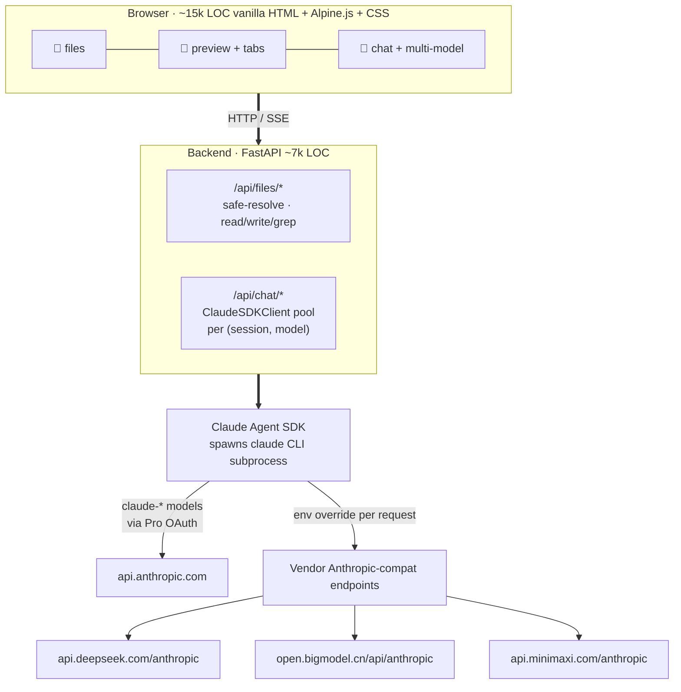

# Architecture

> [简体中文](architecture_zh.md)

## Key design choices

- **SDK > raw API.** We use the Claude Agent SDK (same engine as Claude
  Code), so MCP / Skills / Subagents / plan mode / `CLAUDE.md` auto-load
  work uniformly across providers. Adding a new provider = 3 lines, not
  300.

- **`env=` override per session.** SDK passes a fresh env dict to its
  subprocess. For DeepSeek / GLM / MiniMax we set `ANTHROPIC_BASE_URL` +
  `ANTHROPIC_API_KEY` and an isolated `CLAUDE_CONFIG_DIR` — otherwise the
  CLI silently falls back to Pro OAuth and bills Anthropic for traffic
  meant for a third-party vendor.

- **No bundler, no transpiler.** Edit a file, refresh, done. `vendor/`
  carries vetted runtime (Alpine, marked, DOMPurify, KaTeX, hljs,
  CodeMirror) so install never hits npm. Each library's license is
  attributed in [THIRD_PARTY_LICENSES.md](../THIRD_PARTY_LICENSES.md).

- **Session = `(session_id, model)`** cached client. Switching model
  spawns a fresh client; per-message `model` field on assistant bubbles
  keeps badges accurate after reload.

- **Personal context as first-class data.** `MUSELAB_ROOT` points at a
  directory you own. The installer creates six sub-directories —
  `health / work / money / people / notes / archives` — and a
  project-level `CLAUDE.md` auto-loaded into every conversation. The
  assistant treats files in those directories as the working set, not as
  documents to be retrieved on demand.
