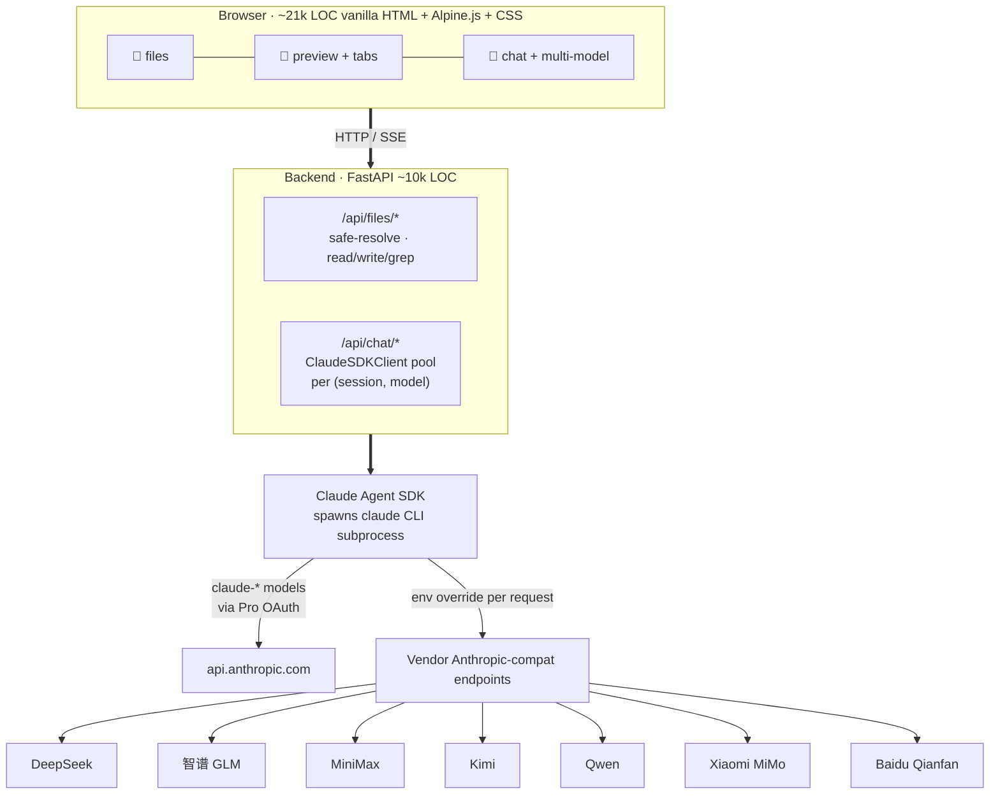

# Architecture

> [简体中文](architecture_zh.md)

## Key design decisions

- **SDK over raw API.** Claude Agent SDK (same engine as Claude Code), so MCP / Skills / Subagents / plan mode / `CLAUDE.md` auto-load behave uniformly across providers. New providers: see [add-provider.md](add-provider.md).

- **Per-session `env=` override.** Third-party providers are wired by setting `ANTHROPIC_BASE_URL` + `ANTHROPIC_API_KEY` + an isolated `CLAUDE_CONFIG_DIR`. The last one blocks the CLI from silently falling back to Pro OAuth and routing third-party traffic through your Anthropic account.

- **No build step.** Edit `frontend/`, refresh the browser. Vetted third-party libs live in `vendor/` (licenses in [THIRD_PARTY_LICENSES.md](../THIRD_PARTY_LICENSES.md)); installation never touches npm.

- **Client cache keyed by `(session_id, model)`.** Switching models forks a new session; each assistant message stores its own `model` field so badges stay accurate after reload.

- **Whole-file as the unit of input.** `MUSELAB_ROOT` is a directory you own; the root-level `CLAUDE.md` auto-loads on every conversation. The assistant reaches files via Read / Grep / Edit on demand — no pre-embedding.
