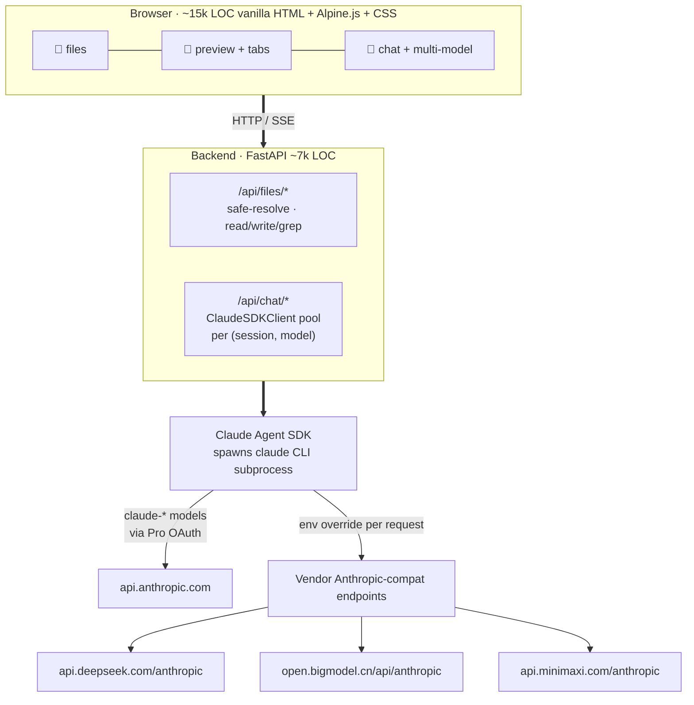

# Architecture

> [简体中文](architecture_zh.md)

## Key design decisions

- **SDK over raw API.** muselab uses the Claude Agent SDK (the same engine
  as Claude Code), so MCP / Skills / Subagents / plan mode / `CLAUDE.md`
  auto-load work uniformly across providers. Adding a new provider requires
  3 lines, not 300.

- **Per-session `env=` override.** The SDK passes a fresh env dict to its
  subprocess. For DeepSeek / GLM / MiniMax, `ANTHROPIC_BASE_URL` +
  `ANTHROPIC_API_KEY` and an isolated `CLAUDE_CONFIG_DIR` are set —
  without this, the CLI silently falls back to Pro OAuth and routes
  third-party traffic through the Anthropic account.

- **No bundler, no transpiler.** Edit a file, refresh, done. `vendor/`
  bundles vetted runtime libraries (Alpine, marked, DOMPurify, KaTeX, hljs,
  CodeMirror), so installation never touches npm. Each library's license is
  attributed in [THIRD_PARTY_LICENSES.md](../THIRD_PARTY_LICENSES.md).

- **Session = `(session_id, model)`** cached client. Switching models
  spawns a fresh client; the per-message `model` field on assistant bubbles
  keeps badges accurate after page reload.

- **Personal context as first-class data.** `MUSELAB_ROOT` points at a
  directory the user owns. The installer creates six subdirectories —
  `health / work / money / people / notes / archives` — and a root-level
  `CLAUDE.md` that is auto-loaded into every conversation. The assistant
  treats files in those directories as the active working set, not as
  documents to be retrieved on demand.
