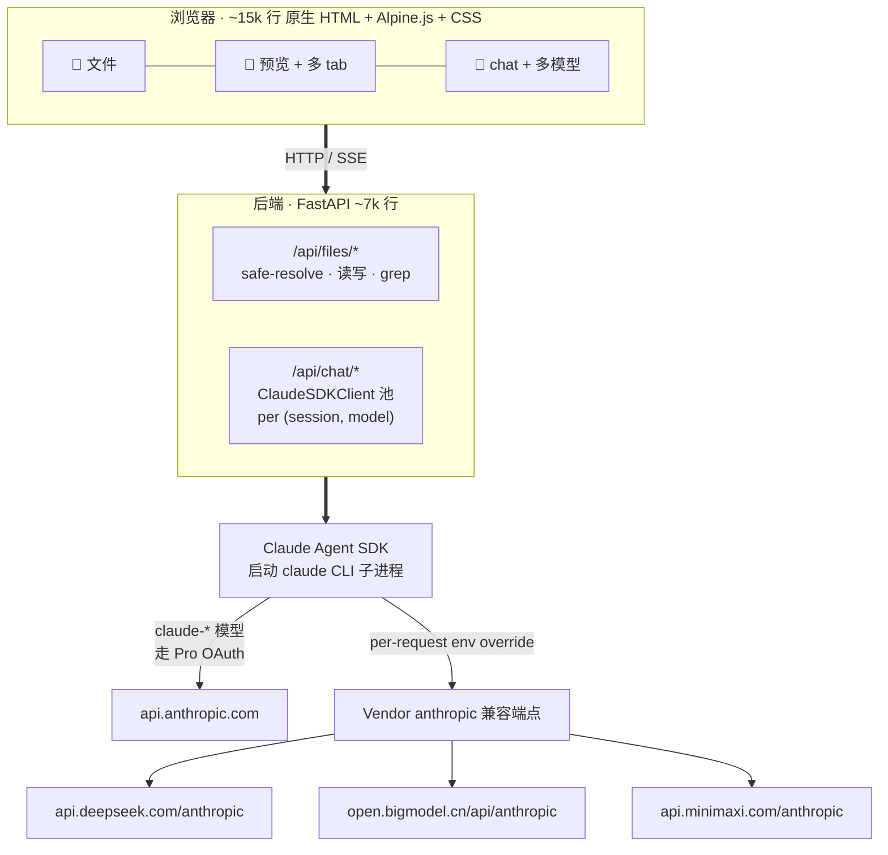

# 架构

> [English](architecture.md)

## 关键设计决策

- **使用 SDK 而非原始 API。** Claude Agent SDK 与 Claude Code 使用同一引擎，因此 MCP / Skills / Subagent / plan 模式 / `CLAUDE.md` 自动加载在所有提供商上行为一致。接入新提供商仅需 3 行配置。

- **会话级环境变量覆盖。** SDK 向子进程传入独立的环境变量字典。接入 DeepSeek / GLM / MiniMax 时，设置 `ANTHROPIC_BASE_URL` + `ANTHROPIC_API_KEY` 及隔离的 `CLAUDE_CONFIG_DIR`——否则 CLI 会静默回落至 Pro OAuth，将本应发往第三方的流量计入 Anthropic 账单。

- **无构建工具，无转译器。** 修改文件后刷新浏览器即可生效。`vendor/` 目录包含经过审查的运行时库（Alpine / marked / DOMPurify / KaTeX / hljs / CodeMirror），安装过程不涉及 npm。各库的许可证信息见 [THIRD_PARTY_LICENSES.md](../THIRD_PARTY_LICENSES.md)。

- **会话 = `(session_id, model)` 缓存客户端。** 切换模型时新建客户端；每条助手消息记录自己的 `model` 字段，页面刷新后气泡标识依然准确。

- **个人上下文作为一等数据。** `MUSELAB_ROOT` 指向用户自有目录。安装脚本预置六个子目录——`health / work / money / people / notes / archives`——并在根目录生成 `CLAUDE.md`，每次对话自动加载。助手将这些目录中的文件视为当前工作集，而非按需检索的文档。
