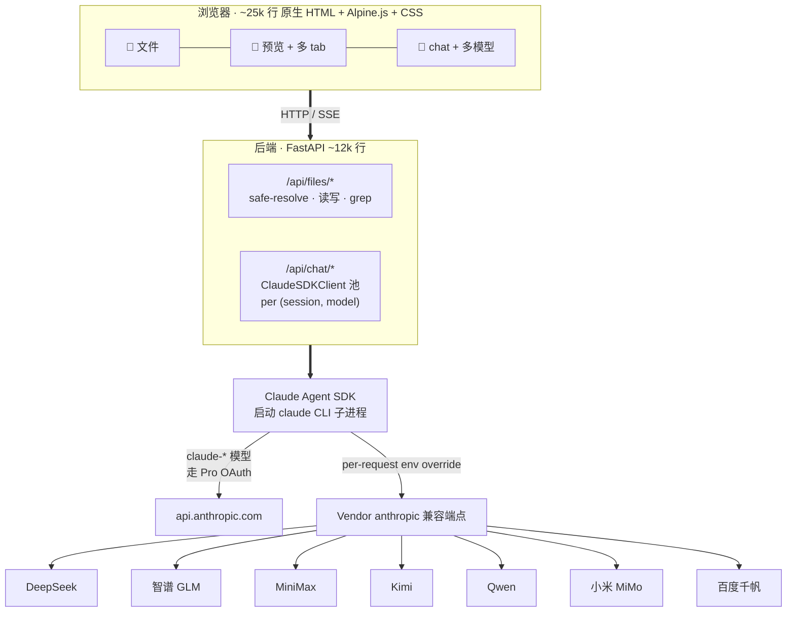

# 架构

> [English](architecture.md)

## 关键设计决策

- **SDK 而非 raw API。** 用 Claude Agent SDK（Claude Code 同款引擎），MCP / Skills / Subagent / plan 模式 / `CLAUDE.md` 自动加载跨厂商行为一致。接入新提供商见 [add-provider_zh.md](add-provider_zh.md)。

- **会话级 env 覆盖。** 第三方提供商通过设置 `ANTHROPIC_BASE_URL` + `ANTHROPIC_API_KEY` + 隔离的 `CLAUDE_CONFIG_DIR` 接入。最后一项防止 CLI 静默回落到 Pro OAuth，把本应发往第三方的流量计到 Anthropic 账单。

- **无构建步骤。** 改 `frontend/` 后刷新浏览器即可。审过的第三方库在 `vendor/`（许可证见 [THIRD_PARTY_LICENSES.md](../THIRD_PARTY_LICENSES.md)），安装不涉及 npm。

- **客户端按 `(session_id, model)` 缓存。** 切换模型 fork 新会话；每条助手消息存自己的 `model` 字段，刷新后气泡标识仍准确。

- **整文件作为输入单元。** `MUSELAB_ROOT` 指向用户自有目录，根级 `CLAUDE.md` 每次对话自动加载。助手通过 Read / Grep / Edit 工具按需访问，不预先向量化。
