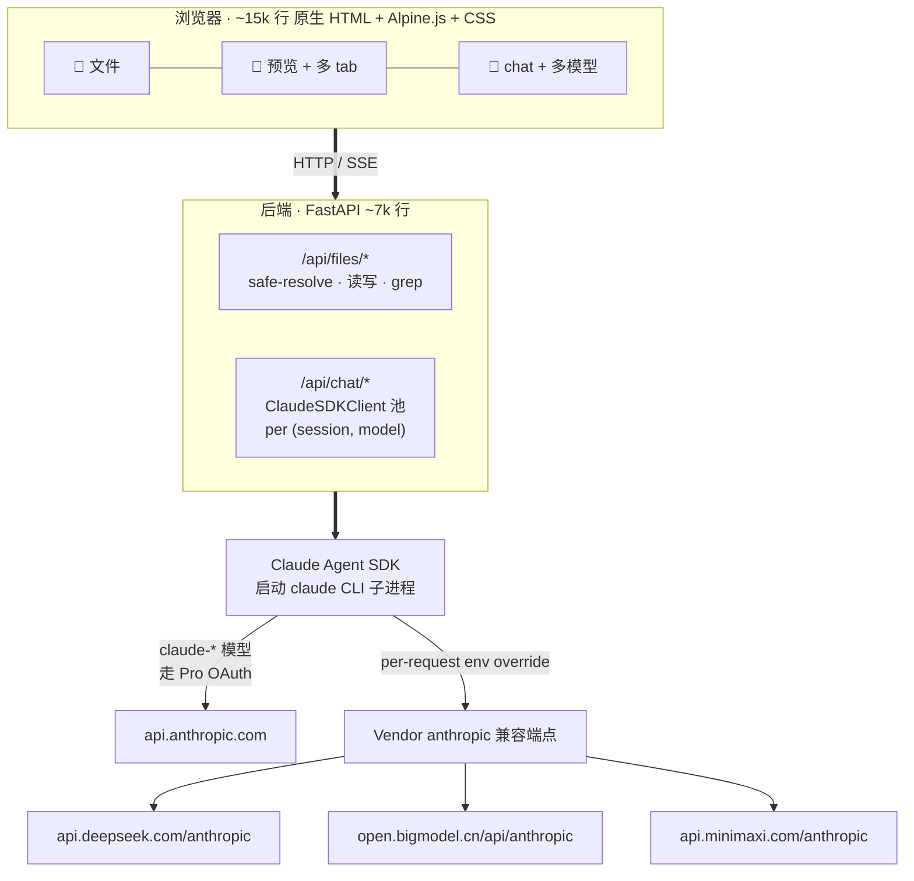

# 架构

> [English](architecture.md)

## 关键设计决策

- **用 SDK 而非原始 API**。Claude Agent SDK 是 Claude Code 同款引擎，因此
  MCP / Skills / Subagent / plan / `CLAUDE.md` auto-load 在所有 provider 上
  行为一致。新增 provider 仅需 3 行配置，不是 300 行。

- **per-session `env=` override**。SDK 向子进程传入独立的 env dict。DeepSeek /
  GLM / MiniMax 时设置 `ANTHROPIC_BASE_URL` + `ANTHROPIC_API_KEY` + 隔离的
  `CLAUDE_CONFIG_DIR`——否则 CLI 会静默回落至 Pro OAuth，把本该走第三方的流量
  挂到 Anthropic 账单上。

- **无 bundler 无 transpiler**。编辑文件刷新浏览器即生效。`vendor/` 内放置
  经过校验的 runtime（Alpine / marked / DOMPurify / KaTeX / hljs / CodeMirror），
  安装过程不下载 npm 包。每个库的授权见
  [THIRD_PARTY_LICENSES.md](../THIRD_PARTY_LICENSES.md)。

- **Session = `(session_id, model)`** 缓存 client。切换 model 时新建 client；
  每条 assistant 消息存自己的 `model` 字段，reload 后 bubble badge 依然准确。

- **个人上下文是一等公民**。`MUSELAB_ROOT` 指向用户自有目录。安装脚本预置六个
  子目录——`health / work / money / people / notes / archives`——并在根目录
  生成 `CLAUDE.md`，每次对话自动加载。模型把这些目录下的文件当作工作集，
  而不是按需召回的文档。
