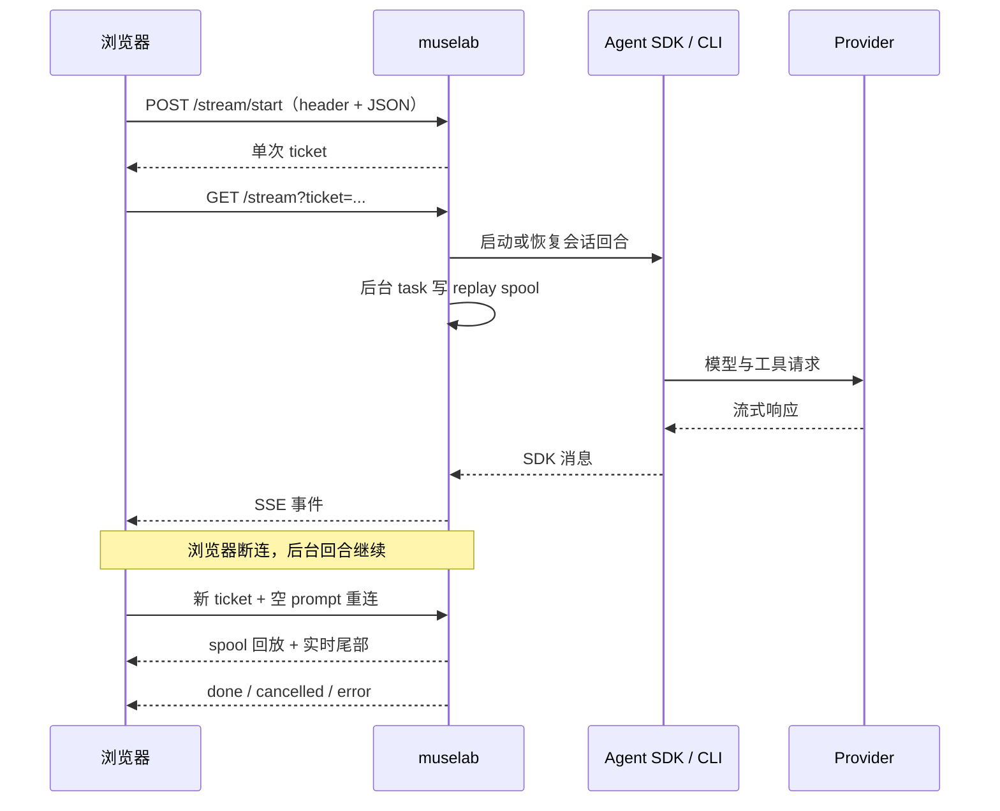

# 模型路由与对话回合循环

> [English](routing.md)

本页说明模型选择、SDK 客户端池、第三方 provider 环境隔离，以及 SSE 回合的启动、后台执行和断线重连。

## 模型解析与锁定

新会话按以下顺序解析模型：

1. 请求指定且当前可用的模型；
2. `MUSELAB_MODEL` 指定且当前可用的模型；
3. 第一个可用 provider 的第一个模型；
4. 尚未配置 provider 时保持为空，由 UI 引导配置。

首回合开始后，会话保存实际模型。之后优先使用锁定模型，而不是当前下拉框值，避免把一个 provider 产生的 thinking signature 重放给另一个不兼容的 endpoint。

从未产生 CLI JSONL 的空会话可以在原 provider 不可用时自愈到当前默认模型；已有真实历史的会话不会自动跨 provider。

## SDK 客户端池

客户端缓存键为 `(session_id, model, effort)`，默认最多保活 3 个，可用 `MUSELAB_CLIENT_POOL_CAP` 调整。

- 同一个键的并发创建由专用锁合并。
- 命中缓存时更新 LRU。
- 权限模式是 SDK 进程的启动契约；与缓存运行时不符时会在安全边界重建，而不是悄悄沿用旧权限。
- 活跃回合或仍有 SDK 后台任务的客户端不会被淘汰；必要时池可暂时超过上限。
- 修改模型、effort、thinking 或权限后，下一次安全时机重建该会话运行时。
- 配置外部 MCP 时，首次连接会等待工具集稳定后再开始回合。

同一会话的交互回合、定时任务、原生 compact 和其他 SDK 操作共享串行锁，防止同时读取同一个 CLI 流。

## 第三方 provider 环境

Anthropic 使用正常 Claude CLI 登录或密钥环境。其他 provider 获取一份最小化的完整环境替换：

- 保留进程运行、locale、代理和 TLS 所需变量；
- 注入当前 provider 的 base URL 与 key；
- 清空 Claude OAuth 回退变量；
- 使用持久且按用户隔离的 `CLAUDE_CONFIG_DIR`，默认位于
  `~/.local/state/muselab/vendor-cli`（设置 `XDG_STATE_HOME` 时随之调整）；
- 不传入 `MUSELAB_TOKEN` 或其他 provider 的 key。

这样既支持 Anthropic-compatible endpoint，也降低凭据串用和静默回退到 Anthropic 的风险。

## 启动 SSE 回合

新客户端应使用一次性 ticket：

```text
POST /api/chat/stream/start
X-Auth-Token: <token>
Content-Type: application/json

{
  "prompt": "...",
  "session_id": "...",
  "model": "...",
  "permission": "default",
  "image_ids": "a1,b2",
  "mobile": false
}
```

返回 `{"ticket":"..."}` 后，连接：

```text
GET /api/chat/stream?ticket=<single-use-ticket>
```

ticket 有效期 60 秒且首次使用即销毁。prompt、附件参数和长期 token 都不会进入 SSE URL。查询参数 token 形式仅作为旧客户端兼容路径。

空 prompt 且无附件时为重连订阅；空 prompt 但有附件时仍会启动一个新回合。

## 回合广播与 replay spool

回合由独立后台 task 驱动，HTTP SSE 连接只是订阅者。浏览器断开不会取消 Agent；后端继续消费 SDK 输出、写入会话和更新 Activity Center。

每个 `TurnBroadcast` 把事件追加到操作系统临时目录中的 JSONL replay spool。订阅者各自持有文件游标，因此慢连接不会积累无限的 Python 队列，也不会为每个浏览器复制完整事件列表。

连接或重连时：

1. 从 spool 回放已产生事件；
2. 在同一文件尾部等待新事件；
3. 回合结束后收到终止标记。

普通桌面订阅保留完整回放体验。移动端若回放超过 `MUSELAB_STREAM_REPLAY_MAX_EVENTS`（默认 512）或 `MUSELAB_STREAM_REPLAY_MAX_BYTES`（默认 2 MiB），会收到 `resync`，改为重新读取持久化会话，避免大回放占用移动端资源。

进行中的回合保存在内存活动表。刚结束的回合默认再保留 60 秒，可用 `MUSELAB_RECENT_TURN_TTL` 调整，以便队列自动启动的快速回合仍可被晚到的浏览器接上。过期后关闭并删除临时 spool。

后台回合硬超时为 30 分钟。显式中断会标记回合为取消，并暂停仍有内容的服务端队列。

## 重连与跨设备状态

- `GET /api/chat/sessions/{sid}/active` 返回当前回合、事件数和继续订阅所需信息。
- 会话列表的 `active` 字段让其他设备看到真实运行状态。
- 页面重载后，前端通过活动轮询发现回合，并以空 prompt 的 ticket 请求接回 replay 与实时尾部。
- 服务进程被强制终止时，磁盘回合哨兵会在下次启动生成“已中断”提示；临时 replay spool 不用于跨进程恢复。

Activity Center 把每个会话的当前状态持久化在 `$MUSELAB_ROOT/.muselab/activity.json`。它用于跨工作目录展示运行中、等待和结束状态，不替代 CLI 对话记录。

## 主要 SSE 事件

| 事件 | 含义 |
|---|---|
| `text`、`thinking` | 文本与思考增量 |
| `tool_use`、`tool_result` | 工具调用和结果 |
| `task_started`、`task_progress`、`task_notification` | SDK 后台任务生命周期 |
| `rate_limit` | provider 或订阅额度状态 |
| `ask_user_question` | Agent 等待用户回答 |
| `permission_request` | Agent 等待工具审批 |
| `resync` | 移动端回放过大，应重新读取会话 |
| `done` | 回合成功完成，携带时间、费用和 token 摘要 |
| `cancelled` | 用户中断 |
| `error` | 鉴权、额度、网络、跨 provider、会话或 SDK 错误 |

## effort 与 thinking

- `effort` 按会话保存，也是客户端缓存键的一部分；有效值为 `low`、`medium`、`high`、`xhigh`、`max`，空值使用 SDK 默认。
- 扩展思考预算默认 10,000 token，可用 `MUSELAB_THINKING_BUDGET` 调整。
- provider 是否显示 effort、是否支持 thinking，以 `/api/chat/providers` 返回的能力为准。


